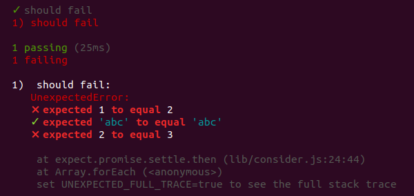

# consider

Plugin for the [Unexpected](http://unexpected.js.org) assertion library that stops
it from throwing exceptions when an assertion fails. Instead,
it will hook into `afterEach` and render a report of all assertions
that failed and succeeded.

Example:

```js
const expect = require('unexpected').clone().use(require('consider'));

it('should fail', () => {
  expect(1, 'to equal', 2);
  expect('abc', 'to equal', 'abc');
  expect(2, 'to equal', 3);
});
```

Produces the following output when run through [mocha](https://mochajs.org/):


